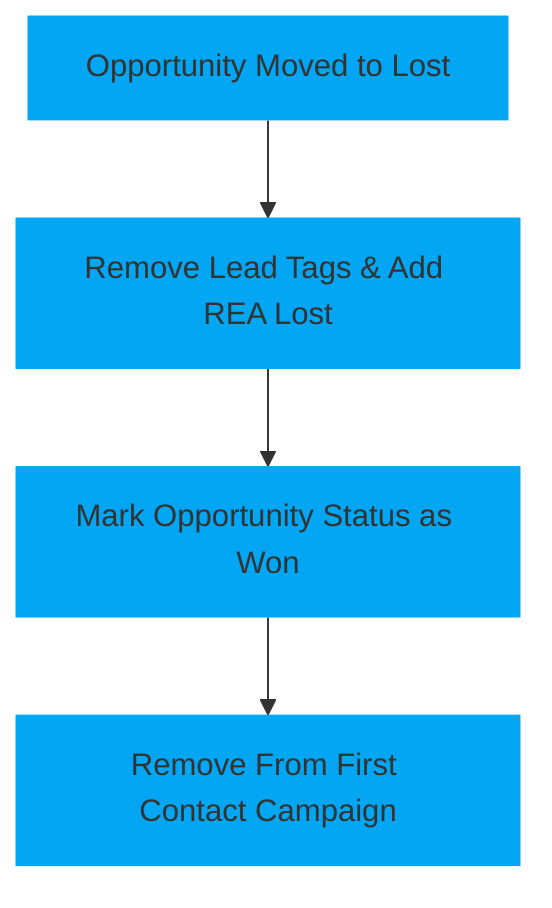

<!--   This page is a template for a page explaining a automation workflow   -->
# Agents Lead Lost

This automation handles the cleanup and tracking for leads moving into the [`Lost`](\pipelines\agents\#pipeline-stages) stage within the [`Agent: New Lead pipeline`](\pipelines\agents).

# <!-- Padding so the chart isnt so close to the text -->

