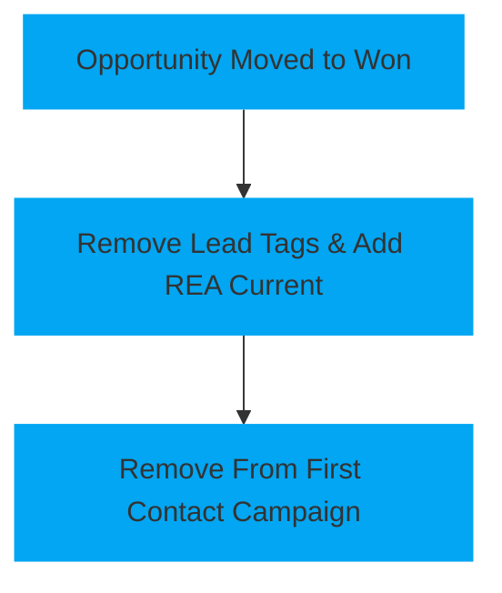

<!--   This page is a template for a page explaining a automation workflow   -->
# Agents Lead Won

This automation handles the successful closing and tagging transition for opportunities moving into the [`Won`](\pipelines\agents\#pipeline-stages) stage within the [`Agent: New Lead pipeline`](\pipelines\agents).

# <!-- Padding so the chart isnt so close to the text -->

```mermaid
flowchart TD
    opp-moved[Opportunity Moved to Won]:::colour;
    del-tags[Remove Lead Tags & Add REA Current]:::colour;
    rem-camp[Remove From First Contact Campaign]:::colour;

    opp-moved --> del-tags
    del-tags --> rem-camp

    classDef colour fill:#02A6F2,stroke-width:0px;
```