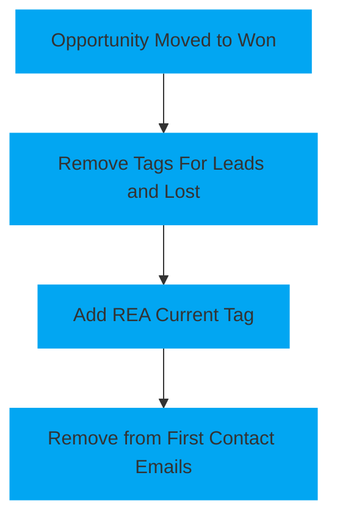

# Agent Lead Won

The goal of the automation is to mark an agent lead as won when its stage gets changed to won.

It achieves this by removing [`rea lead`](\tags\#rea-lead) & [`rea lost`](\tags\#rea-lost) tags and adding [`rea current`](\tags\#rea-current) along with removing from the [`Agents - First Contact`](\automations\campaigns\agents\first-contact) automation.

## <!-- Padding so the chart isnt so close to the text -->

```mermaid
flowchart TD
    A[Opportunity Moved to Won]:::colour;
    B[Remove Tags For Leads and Lost]:::colour;
    C[Add REA Current Tag]:::colour;
    D[Remove from First Contact Emails]:::colour;

    A --> B
    B --> C
    C --> D

    classDef colour fill:#02A6F2,stroke-width:0px;
```