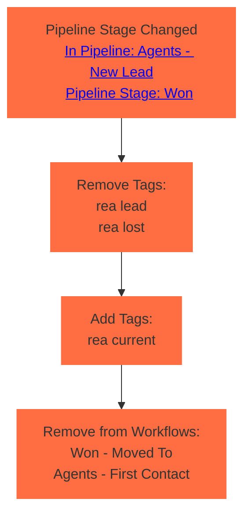

# Agent Lead Won

GHL Name: `Won - Moved To`

GHL Location: `Pipeline: Agents - New Lead / Pipeline Stage: Lost`

## Automation Goal

The goal of the automation is to mark an agent lead as won when its stage gets changed to `won`.

It achieves this by removing `rea lead` tag and adding `rea current` along with removing from the [`Agents - First Contact`](\automations\campaigns\agents\first-contact) automation.

## Automation Process Simplified

## Automation Process Detailed

