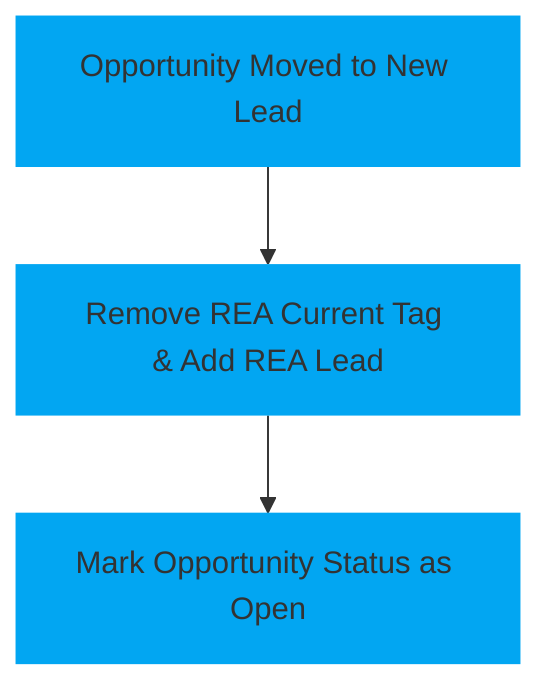

<!--   This page is a template for a page explaining a automation workflow   -->
# Agents New Lead

This automation handles the initial categorization and status reset for leads moving into the [`New Lead`](\pipelines\agents\#pipeline-stages) stage within the [`Agent: New Lead pipeline`](\pipelines\agents).

# <!-- Padding so the chart isnt so close to the text -->

