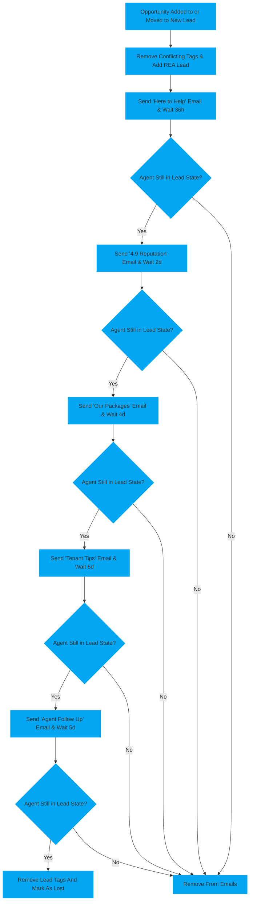

# Agents First Contact

The goal of the automation is to convert agents after initial contact via sending emails until they either respond or dont.

The automation will be triggered when an opportunity is added or moved to [`Agents - New Lead`](\pipelines\agents\#pipeline-stages) It achieves this by adding [`rea lead`](\tags\#rea-lead) tag and sending a total of five emails over the course of eighteen days. If the agent does not respond by then, the previously added tag will be removed and they will me marked as lost.

# <!-- Padding so the chart isnt so close to the text -->

