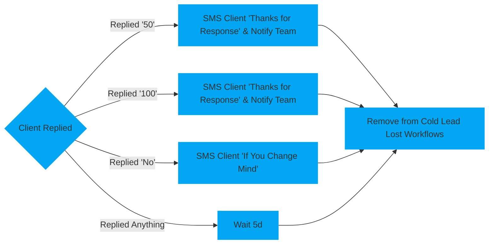

# Cold Lead Lost

The goal of the automation is to try to win back previously lost private customers.

It achieves this by sending about six emails over the course of fifteen days when an opportunity gets moved to lost in the [`Privates Pipeline`](\pipelines\privates)

```mermaid
flowchart TD
    opp-moved[Opportunity Moved to Lost]:::colour;
    first-email[Send 'The Soft Checkin' Email & Wait 3d]:::colour;
    first-check{Client Still in Lead State?}:::colour;
    second-email[Send 'Brand Story' Email & Wait 2d]:::colour;
    second-check{Client Still in Lead State?}:::colour;
    third-email[Send '28Min vs 4Min' Email & Wait 36h]:::colour;
    third-check{Client Still in Lead State?}:::colour;
    fourth-email[Send 'Manufacture Date Trap' Email & Wait 3d]:::colour;
    fourth-check{Client Still in Lead State?}:::colour;
    fifth-email[Send '$50 Cashback' Email+SMS & Wait 5d]:::colour;
    fifth-check{Client Still in Lead State?}:::colour;
    sixth-email[Send '$100 Cashback' Email+SMS & Wait 5d]:::colour;

    opp-moved --> first-email
    first-email --> first-check
    first-check --"Yes"--> second-email
    second-email --> second-check
    second-check --"Yes"--> third-email
    third-email --> third-check
    third-check --"Yes"--> fourth-email
    fourth-email --> fourth-check
    fourth-check --"Yes"--> fifth-email
    fifth-email --> fifth-check
    fifth-check --"Yes"--> sixth-email

    classDef colour fill:#02A6F2,stroke-width:0px;
```

# <!-- Padding so the chart isnt so close to the text -->

