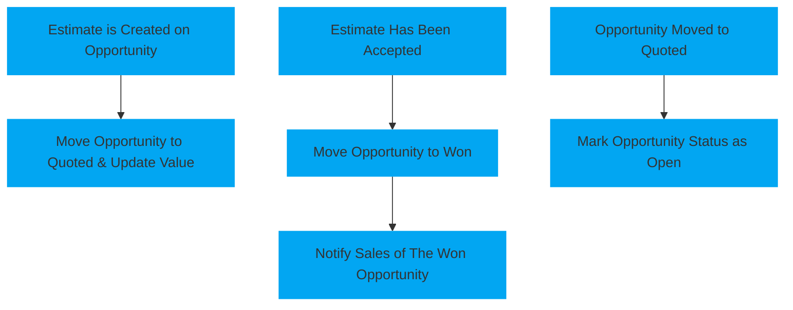

<!--   This page is a template for a page explaining a automation workflow   -->
# Private Lead Quoted

The goal of the automation is to [[Automation Goal]]

It achieves this by [[Automation Simplified Steps]]

# <!-- Padding so the chart isnt so close to the text -->

